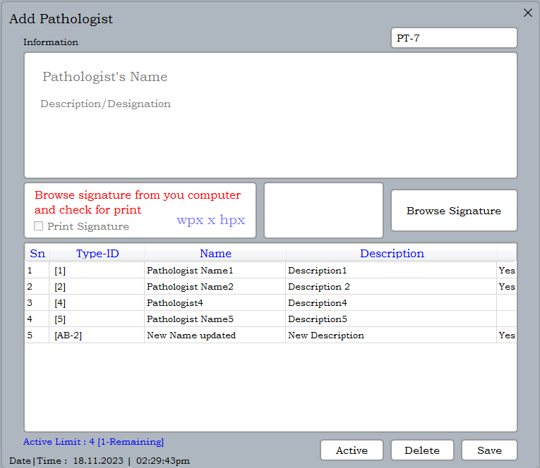
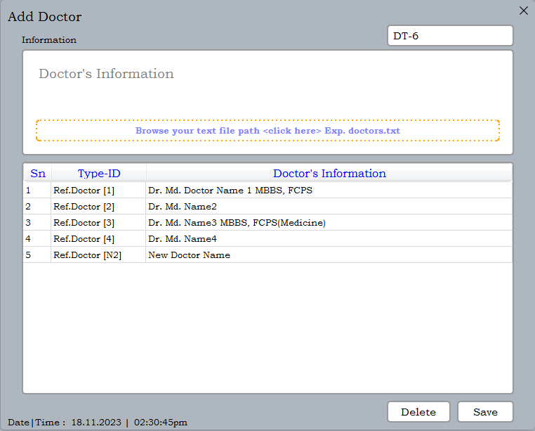
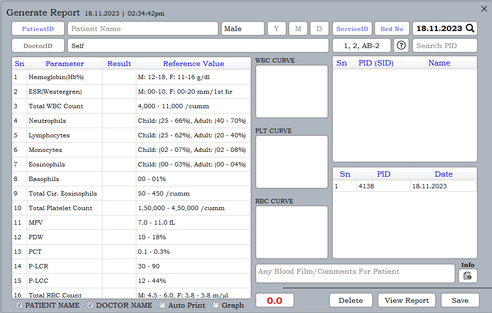
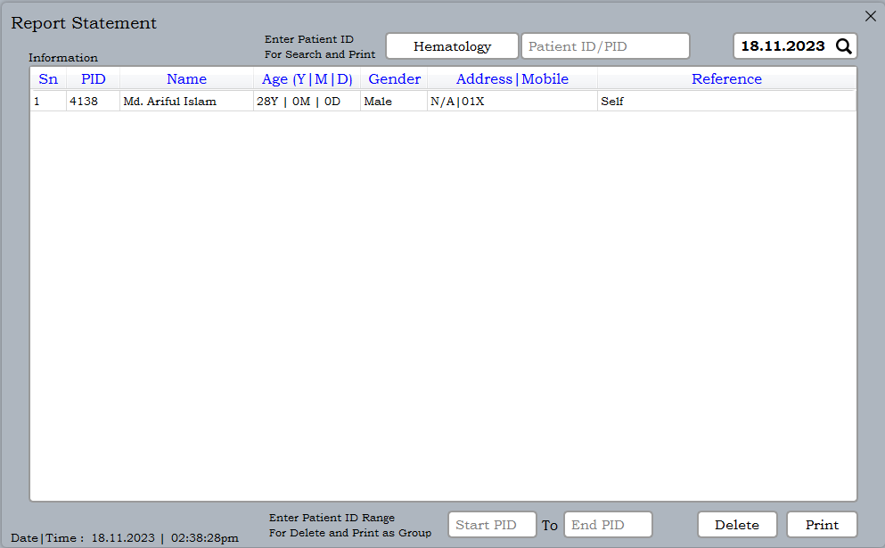
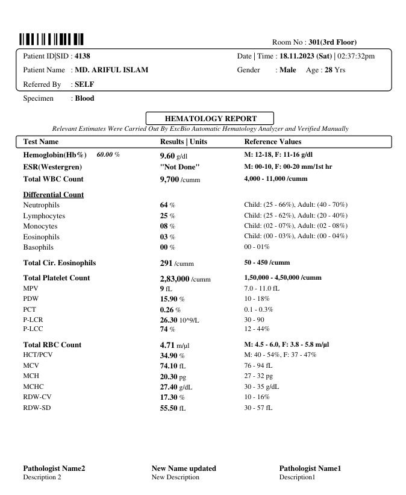
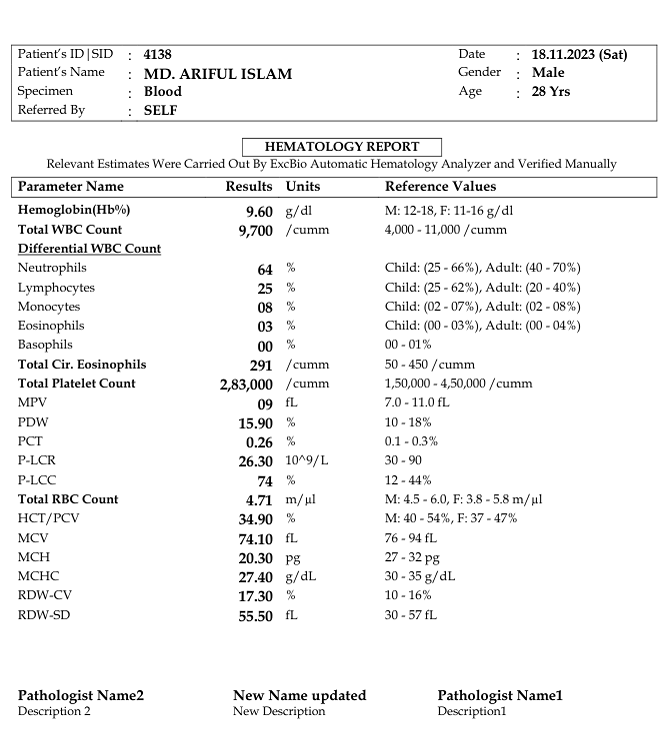
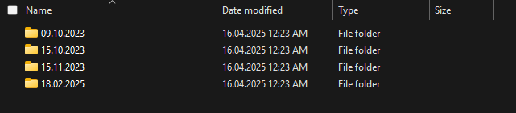
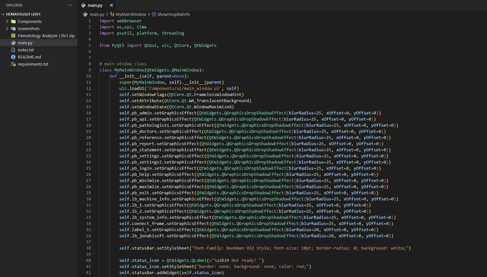

# Hematology Analyzer LISv1

### **A Python-based _hematology analyzer lis system_ using [PyQT5](https://www.riverbankcomputing.com/static/Docs/PyQt5/) GUI**


[PyQt](https://wiki.python.org/moin/PyQt) is a set of Python binding for the Qt Framework from C++ that can be used to create Desktop Graphical User Interfaces. PyQt gives you all the complex functionalities of C++ Qt while allowing swift development in Python.
<br/>

[Hematology Analyzer LIS](https://www.healio.com/news/hematology-oncology/20120331/what-is-hematology) is a software system that records, manages, updates and stores patient testing data for pathology laboratories, including receiving tests orders, sending orders to laboratory analyzers, tracking orders, results and quality control and transmitting results to print with graphs as pdf or docx.
<br/>

**Pathology analyzer communication supporting serial and network protocols with simulates and data exchange with host system. `It will work on any hematology analyzer`.**


## Task Description
This project fully customizable and dynamic and to build a Python and PyQT5-based desktop application and it's directly connect hematology analyzer with network or serial port communcation and receive data from analyzer then change or edit result and print. Printable report generated or design by python package [`reportlab`](https://www.reportlab.com/) library or use `Microsoft Office Docx` file. You can add pathologist information, doctor information with signature. Everyday create report folder with file name is current date and printed result stored as pdf. Already `100+ Diagnostic Medical Center or Hospital` use this. Here are some special features added.

* **Hematology Analyzer LIS v2023.x (Last updated-17.02.2025)**
* **Add image as theme wallpaper**
* **Change any theme color**
* **Change report font color**
* **Live data receive from analyzer**
* **Use docx file template for result**
* **Send/Receive data from database or server using API/Local**


## Task Requirements & Testing Environment
This project was developed using the latest operating systems, software, and tools.

* **Operating System :** Windows7, Windows10, Windows11, Kali Linux2022.4 and MacOS Sierra 10.12
* **Software :** Python3.11 and Visual Studio Code
* **System Type :** 32-bit and 64-bit
* **Analyzer Company :** ExcBio, Hermes, Dymind, Genrui, Sysmex, Beckman Coulter, Arrows, Zybio, BioElab, Mindray, Erba etc as tested.
* **Database :** SQLite3, MySQL Server, MongoDB etc.


## Installation
First [download](https://www.python.org/downloads/), install and configure [python](https://www.python.org/doc/). Then use the package manager [pip](https://pip.pypa.io/en/stable/) to install on.

* Windows installation
* Kali linux installation
* Mac installation
---


## Notes
The `requirements.txt` file, lists of all the Python libraries that my "**_hematology analyzer lis system_**" depends on and installs those packages from the file and for better use, configure the system by looking at the `notes.txt` name file:

```bash
pip install -r requirements.txt
# or
sudo pip install -r requirements.txt
```


## Screenshots
Here are some screenshots of the `Hematology Analyzer LISv1` project:

**Main Window**<br/>
<br/>
**Admin Page**<br/>
<br/>
**Login Page**<br/>
<br/>
**Change Login System**<br/>
<br/>
**Settings Page**<br/>
<br/>
**Extra Settings Page**<br/>
<br/>
**Pathologist Setup**<br/>
<br/>
**Doctor Setup**<br/>
<br/>
**Reference value Setup Page**<br/>
<br/>
**API Setup**<br/>
<br/>
**Report Page**<br/>
<br/>
**Machine Result**<br/>
<br/>
**Statement Page**<br/>
<br/>
**With Histogram-Reportlab**<br/>
<br/>
**Without Histogram-Reportlab**<br/>
<br/>
**With Histogram-Docx**<br/>
<br/>
**Without Histogram-Docx**<br/>
<br/>
**Report Folder**<br/>
<br/>
**Code Snapshot**<br/>
<br/>


## Contributing

Contributions, suggestions, and feedback are always welcome! ❤️
To contribute:

1. Fork the repository
1. Create a new branch (`feature/new-feature`)
1. Commit your changes
1. Push and submit a Pull Request

💬 You can also open an issue if you’d like to discuss a feature or report a bug.


## For more or connect with me

<p align='center'>
  <a href="https://github.com/iamx-ariful-islam"></a>&nbsp;&nbsp;
  <a href="https://bd.linkedin.com/in/iamx-ariful-islam"></a>&nbsp;&nbsp;
  <a href="https://x.com/mx_ariful_islam"></a>&nbsp;&nbsp;
  <a href="https://www.facebook.com/iamx.ariful.islam/"></a>
</p>


## License

The [MIT](https://choosealicense.com/licenses/mit/) License (MIT)


## 💖 Thank You for Visiting!

> “Good design is about making things simple yet significant”  
> — *Md. Ariful Islam*
